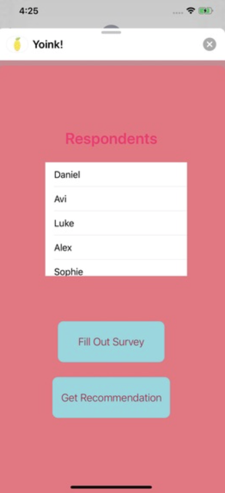
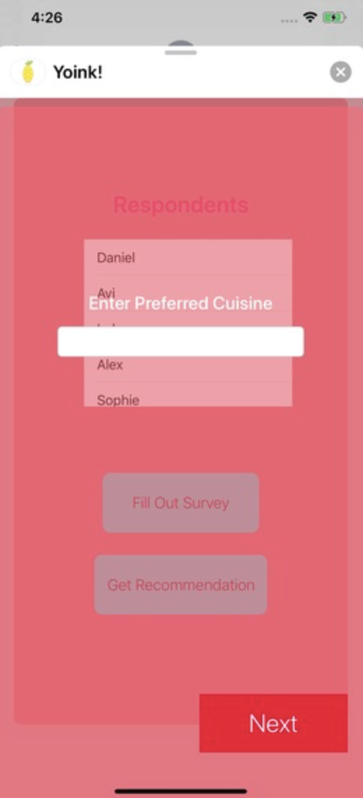
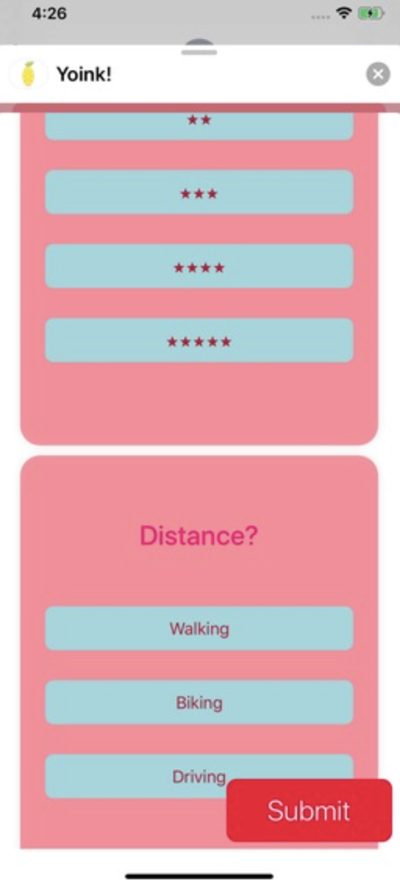
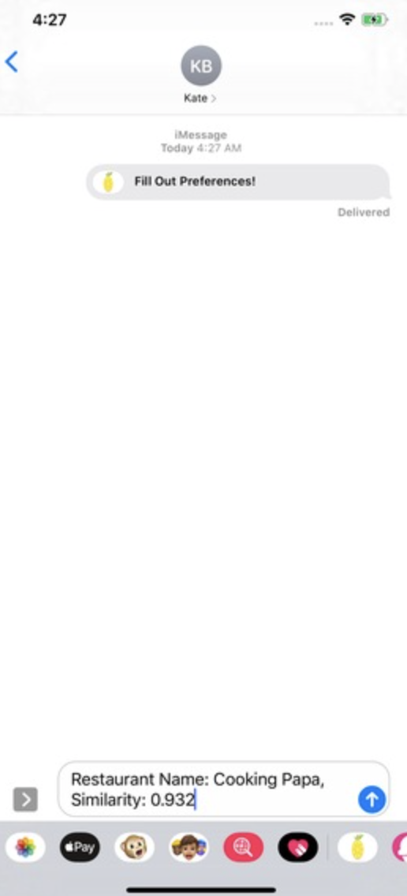

# yoink-backend
Developed for TreeHacks 2020 by Daniel Chao, Avi Gupta, and Luke Tchang.

# description
Yoink is an iMessage App that can be sent in a group chat. Members of the group can enter their preferences for restaurant rating, price level, cuisine, and distance (walking, biking, or driving). The application keeps track of who has responded, and members of the group can request a recommendation at any time. At that point, the algorithm makes a recommendation for a restaurant that weights each person's criteria equally (relative to each person) and finds a restaurant that closely matches an 'average' combination of each person's criteria.

# visuals

